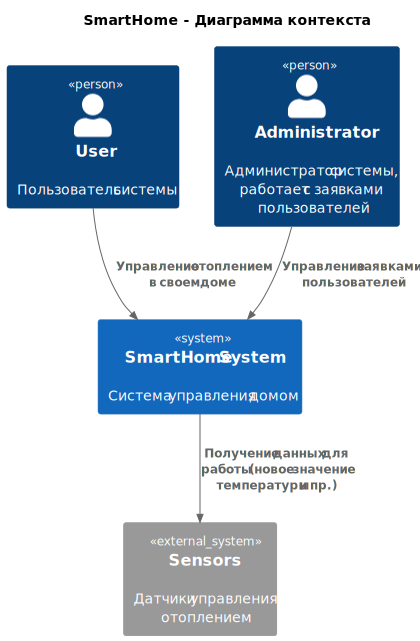

# Проект "Smart Home"

## Описание текущей системы

Проект "Smart Home" представляет собой приложение для управления домом. В данный момент поддерживается управление 
отоплением и мониторинга температуры в умном доме. Пользователи могут удаленно включать/выключать отопление, 
устанавливать желаемую температуру и просматривать текущую температуру через веб-интерфейс.

Диаграмма контекста показана ниже:  


Приложение выделяет следующие доменные области:
- Управление устройствами в домах;
- Работа с телеметрией;
- Управление пользователями;
- Работа с заявками от клиентов.

## Базовая настройка

### Запуск minikube

[Инструкция по установке](https://minikube.sigs.k8s.io/docs/start/)

```bash
minikube start
```


### Добавление токена авторизации GitHub

[Получение токена](https://github.com/settings/tokens/new)

```bash
kubectl create secret docker-registry ghcr --docker-server=https://ghcr.io --docker-username=<github_username> --docker-password=<github_token> -n default
```


### Установка API GW kusk

[Install Kusk CLI](https://docs.kusk.io/getting-started/install-kusk-cli)

```bash
kusk cluster install
```


### Настройка terraform

[Установите Terraform](https://yandex.cloud/ru/docs/tutorials/infrastructure-management/terraform-quickstart#install-terraform)


Создайте файл ~/.terraformrc

```hcl
provider_installation {
  network_mirror {
    url = "https://terraform-mirror.yandexcloud.net/"
    include = ["registry.terraform.io/*/*"]
  }
  direct {
    exclude = ["registry.terraform.io/*/*"]
  }
}
```

### Применяем terraform конфигурацию 

```bash
cd terraform
terraform apply
```

### Настройка API GW

```bash
kusk deploy -i api.yaml
```

### Проверяем работоспособность

```bash
kubectl port-forward svc/kusk-gateway-envoy-fleet -n kusk-system 8080:80
curl localhost:8080/hello
```


### Delete minikube

```bash
minikube delete
```
