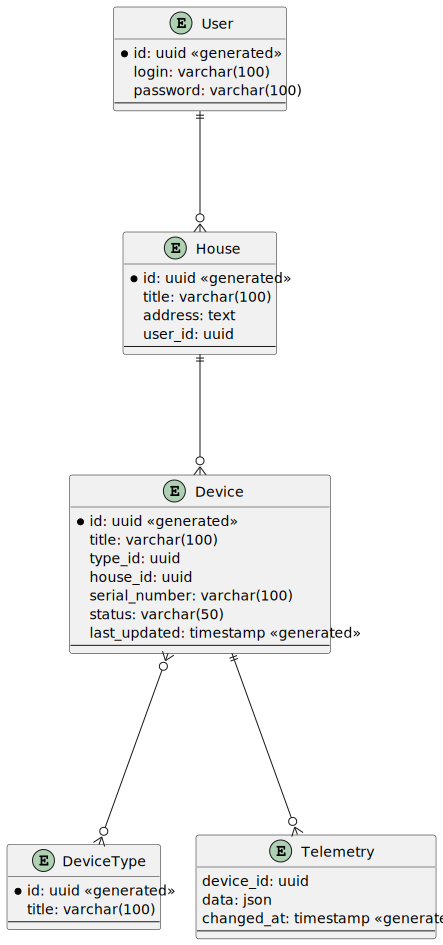

# Проект "Smart Home"

## Описание текущей системы (модель AsIs)

Проект "Smart Home" представляет собой приложение для управления домом. В данный момент поддерживается управление 
отоплением и мониторинга температуры в умном доме. Пользователи могут удаленно включать/выключать отопление, 
устанавливать желаемую температуру и просматривать текущую температуру через веб-интерфейс.

Диаграмма контекста показана ниже:  


Приложение выделяет следующие доменные области:
- Управление устройствами в домах;
- Работа с телеметрией;
- Управление пользователями;
- Управление домами и модулями;
- Техническая поддержка клиентов, работа с заявками от клиентов.

## Модернизация системы под высокие нагрузки (модель ToBe) 

Ниже представлена диаграмма контейнеров новой версии проекта "Smart Home", ориентированного на расширение 
и развитие согласно планам увеличения базы клиентов:


Диаграмма показывает плавный переход от монолита к микросервисам. На диаграмме показаны следующие компоненты:
- `User` - Конечный пользователь системы "Smart Home", который регистрируется в системе и может добавлять свои устройства и управлять ими;
- `UI WebApplications` - Основное веб-приложение с пользовательским интерфейсом для взаимодействия с системой конечными пользователями и администраторами; 
- `API Gateway` - Точка входа в систему, выполняет маршрутизацию запросов, балансировку нагрузки, аутентификацию и авторизацию;
- `Smart Home Monolith` - Основная часть монолитного приложения;
- `Devices Service` - Сервис управления устройствами - часть нового кода, вынесенная из монолита.
Сервис будет обрабатывать большое количество конкурентных запросов, поэтому языком программирования был выбран Erlang/OTP и веб-сервер Cowboy;
- `Telemetry Service` - Сервис управления телеметрией устройств - часть нового кода, вынесенная из монолита.
Сервис будет обрабатывать большое количество конкурентных запросов, поэтому языком программирования был выбран Erlang/OTP и веб-сервер Cowboy;
- `Devices` - Устройства, которые взаимодействуют с системой "Smart Home". Получают настройки для работы и передают информацию о телеметрии.

В первой итерации были выделены два основных сервиса: `Devices Service` и `Telemetry Service`.

### Devices Service

Ниже показана диаграмма компонентов сервиса Device Service:


На диаграмме показаны следующие компоненты:
- API Handler - Обработчик входящих HTTP-запросов;
- Requests Parser - Компонент, который разбирает входящие запросы и формирует внутренние структуры данных;
- Database API - Компонент, предоставляющий API для работы с базой данных сервиса;
- Response Serializer - Компонент, который преобразовывает внутренние структуры данных в ответ на запрос.

### Telemetry Service

Структура сервиса Telemetry Service имеет аналогичную структуру компонентов, как у сервиса  Devices Service.  
Ниже показана диаграмма компонентов сервиса Telemetry Service:


На диаграмме показаны следующие компоненты:
- API Handler - Обработчик входящих HTTP-запросов;
- Requests Parser - Компонент, который разбирает входящие запросы и формирует внутренние структуры данных;
- Database API - Компонент, предоставляющий API для работы с базой данных сервиса;
- Response Serializer - Компонент, который преобразовывает внутренние структуры данных в ответ на запрос.

### Логическая модель данных (ER-диаграмма)

Ниже показана ER-диаграмма модели данных проекта "Smart Home":


На диаграмме показаны следующие сущности:
- `User` - Пользователь. Имеет следующие атрибуты:
  - `id` - Уникальный идентификатор пользователя;
  - `login` - Логин пользователя;
  - `password` - Пароль пользователя;
- `House` - Дом. имеет следующие атрибуты:
  - `id` - Уникальные идентификатор дома;
  - `title` - Название дома, которое дает пользователь;
  - `address` - Адрес дома;
  - `user_id` - Идентификатор пользователя, которому принадлежит дом - внешний ключ;
- `Device` - Устройство. Имеет следующие атрибуты:
  - `id` - Уникальный идентификатор устройства;
  - `title` - Название устройства;
  - `type_id` - Тип устройства - внешний ключ к таблице DeviceType;
  - `house_id` - Идентификатор дома - внешний ключ
  - `serial_number` - Серийный номер устройства;
  - `status` - Текущее состояние устройства (включено/выключено);
  - `last_updated` - Последнее время изменения данных устройства;
- `DeviceType` - Тип устройства. Имеет следующие атрибуты:
  - `id` - Уникальный идентификатор типа устройства;
  - `title` - Заголовок типа устройства;
- `Telemetry` - Телеметрия устройств.  Имеет следующие атрибуты:
  - `device_id` - Идентификатор устройства;
  - `data` - Данные телеметрии устройства;
  - `changed_at` - Время передачи данных телеметрии.

### REST API

REST API проекта "Smart Home" описан в файле [api.yaml](./api.yaml).

## Базовая настройка

### Запуск minikube

[Инструкция по установке](https://minikube.sigs.k8s.io/docs/start/)

```bash
minikube start
```


### Добавление токена авторизации GitHub

[Получение токена](https://github.com/settings/tokens/new)

```bash
kubectl create secret docker-registry ghcr --docker-server=https://ghcr.io --docker-username=<github_username> --docker-password=<github_token> -n default
```


### Установка API GW kusk

[Install Kusk CLI](https://docs.kusk.io/getting-started/install-kusk-cli)

```bash
kusk cluster install
```


### Настройка terraform

[Установите Terraform](https://yandex.cloud/ru/docs/tutorials/infrastructure-management/terraform-quickstart#install-terraform)


Создайте файл ~/.terraformrc

```hcl
provider_installation {
  network_mirror {
    url = "https://terraform-mirror.yandexcloud.net/"
    include = ["registry.terraform.io/*/*"]
  }
  direct {
    exclude = ["registry.terraform.io/*/*"]
  }
}
```

### Применяем terraform конфигурацию 

```bash
cd terraform
terraform apply
```

### Настройка API GW

```bash
kusk deploy -i api.yaml
```

### Проверяем работоспособность

```bash
kubectl port-forward svc/kusk-gateway-envoy-fleet -n kusk-system 8080:80
curl localhost:8080/hello
```


### Delete minikube

```bash
minikube delete
```
